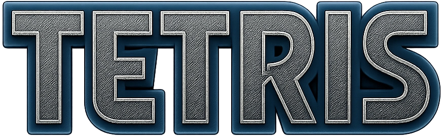

# Tetris

A modern implementation of the classic Tetris game built with JavaScript and Vite.



## 🎮 Features

- Classic Tetris gameplay with modern web technologies
- Responsive design that works on desktop and mobile devices
- Multiple background music tracks and sound effects
- Touch controls for mobile play
- Progressive Web App (PWA) support for offline play
- Level progression system with unique backgrounds per level
- Fullscreen support


## 🚀 Getting Started

### Prerequisites

- Node.js (v16 or higher recommended)
- npm or yarn

### Installation

1. Clone the repository:

```bash
git clone https://github.com/klevze/tetris.git
cd tetris
```

2. Install dependencies:

```bash
npm install
# or
yarn
```

### Development

Start the development server:

```bash
npm run dev
# or
yarn dev
```

The game will be available at `http://localhost:5173` (or another port if 5173 is in use).

### Building for Production

Build the project for production:

```bash
npm run build
# or
yarn build
```

This will generate optimized assets in the `dist` directory.

### Preview Production Build

```bash
npm run preview
# or
yarn preview
```

## 🎹 Controls

### Desktop
- **Arrow Left/Right**: Move piece horizontally
- **Arrow Down**: Soft drop
- **Arrow Up**: Rotate piece
- **Spacebar**: Hard drop
- **P**: Pause game

### Mobile
- **Swipe Left/Right**: Move piece horizontally
- **Swipe Down**: Soft drop
- **Tap**: Rotate piece
- **Swipe Up**: Hard drop
- **Button (on-screen)**: Pause game

## 🧱 Game Architecture

The game is structured using an ES6 module architecture:
- `main.js`: Entry point that bootstraps the application
- `game.js`: Core game controller managing state and game flow
- Other specialized modules handling specific functionality (blocks, grid, effects, etc.)

## 🛠️ Technologies

- **Vite**: Fast build tool and dev server
- **Sass**: For structured styling
- **Firebase**: For potential online features or score tracking
- **PWA Support**: For installable web app experience

## 📱 Progressive Web App

This game can be installed as a Progressive Web App on compatible devices:
1. Open the game in a web browser
2. Look for "Add to Home Screen" or installation prompt
3. Enjoy the game in fullscreen mode with offline support

## 🤝 Contributing

Contributions are welcome! Feel free to submit pull requests or open issues to improve the game.

## 📝 License

This project is licensed under the terms found in the [LICENSE](LICENSE) file.

---

Built with ❤️ and JavaScript